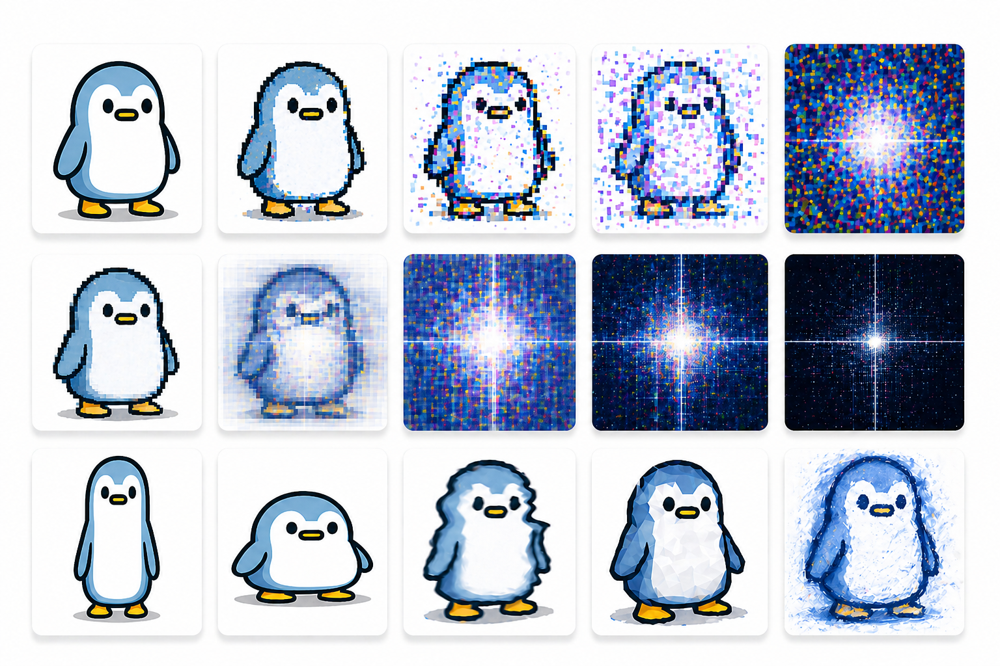

# 🐧 Fractal Hunter Dataset
**Identity Recognition under Structured Distortion**  
*Author: Andrew Garcia, 2026*

---

## Overview

The Fractal Hunter Dataset is a synthetic image dataset for studying robust identity recognition under heavy, structured distortion.

It asks a deceptively simple question:

> **Can a model determine whether an image originates from a source object — even after severe transformation?**

The dataset is built around a cartoon penguin character ("Blorbo") and a set of carefully constructed counterexamples. Images are progressively distorted through frequency-based transformations, making identity increasingly difficult to recover. It is designed to make models fail in interesting and measurable ways.


*Left to right: original seed image → structured distortions → pure frequency-domain representations. Bottom row: seed style variants.*

---

## Task

Binary classification:

| Label | Meaning |
|-------|---------|
| `blorbo` | Image derived from the source identity |
| `not_blorbo` | Image not derived from the source |

The challenge is not appearance — it is recognizing **identity under distortion**.

---

## Dataset Structure

```bash
seed/
  ├── blorbo/         # Source identity images
  └── not_blorbo/     # Counterexample identities

challenge/
  ├── blorbo/         # Distorted blorbo samples
  └── not_blorbo/     # Distorted counterexample samples

scripts/
  gen_fft.py
  gen_mixed.py
  rename_challenge.py
```

### `seed/`
Base images representing source identities and counterexamples. These are the ground truth from which all challenge samples are derived.

### `challenge/`
The final dataset used for training and evaluation. Derived from `seed/` through structured, reproducible distortion pipelines.

---

## ⚠️ Data Splitting (Critical)

> Split by **base images in `seed/`**, NOT by images in `challenge/`.

Multiple samples in `challenge/` originate from the same seed image. Splitting by challenge images will cause severe **data leakage** and invalidate evaluation results.

---

## Dataset Composition

- ~50 base images (`seed/`)
- ~1800 generated samples (`challenge/`)
- Balanced binary classes

**Transformations include:**
- Frequency-domain (FFT-based) representations
- Magnitude and phase decomposition
- Frequency band isolation
- Progressive blending between spatial and spectral domains

---

## Data Generation

The dataset is procedurally generated for full reproducibility.

**Full pipeline:**
```bash
make
```

**Step by step:**
```bash
uv run python scripts/gen_fft.py
uv run python scripts/gen_mixed.py
uv run python scripts/rename_challenge.py
```

---

## Use Cases

- Robust classification under distribution shift
- Representation learning under transformation
- Invariance and equivariance studies
- Model failure analysis
- Controlled benchmarking under structured distortion

---

## Suggested Experiments

- Accuracy vs. distortion level
- Spatial vs. spectral input comparison
- Reconstruction-assisted classification
- Contrastive / self-supervised learning
- Failure mode analysis

---

## Stack

- Python · NumPy · PIL
- PyTorch / sklearn (recommended for modeling)

---

## Related Project

This dataset is part of the **Fractal Hunter** challenge on WorkDog:  
🔗 https://getworkdog.com/projects/cmo9ike5j0001f1ixjvqqvsrh

Kaggle version for experimentation and benchmarking:  
🔗 https://kaggle.com/datasets/your-link

---

## Citation

```bibtex
@dataset{garcia2026fractalhunter,
  title   = {Fractal Hunter Dataset: Identity Recognition under Structured Distortion},
  author  = {Garcia, Andrew},
  year    = {2026},
  url     = {https://github.com/andrewrgarcia/fractal-hunter-dataset}
}
```

---

## License

MIT License

